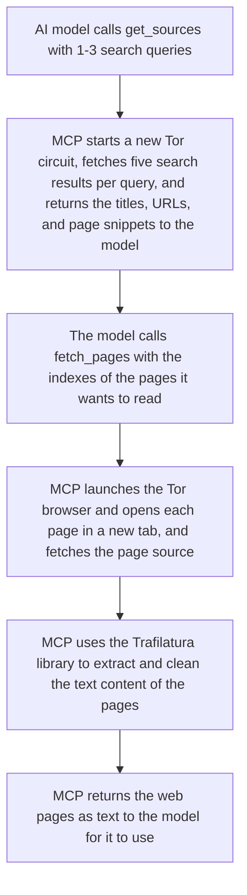

# tor-search-mcp

**Absolutely anonymous knowledge retrieval** for your LLM: the world's first [Model Context Protocol (MCP)](https://modelcontextprotocol.io/) server that exposes tools to search the web and fetch pages anonymously through [Tor](https://www.torproject.org/). Search results come from DuckDuckGo, and page content is retrieved through an actual Tor Browser instance, preserving the universal fingerprint that makes Tor users indistinguishable from one another.

## Why this exists

Millions of people use local LLMs through apps like [LM Studio](https://lmstudio.ai/) or [Ollama](https://ollama.com/). Running models locally offers an extremely private and low-cost way to access information, explore ideas, and automate computation. 

Search tools are becoming ubuqitous in LLM chat interfaces—ChatGPT, Gemini, and others use them automatically in the background for most queries. Meanwhile, every web search integration tool recommended for local LLMs route requests through off-the-shelf installations of Google Chrome, Firefox, or Brave, which (despite their marketing) leave specific [browser fingerprints](https://coveryourtracks.eff.org/learn) that can be used to track, surveil, rate-limit, or geo-restrict you. 

This tool takes a different approach: every request flows through the [Tor](https://www.torproject.org/) network and browser, which routes your requests through an anonymity network and makes your traffic indistinguishable from millions of other users.

https://github.com/user-attachments/assets/6ba6fb7e-0f19-4d96-8989-54a0963a8dd9

## Installation

### Prerequisites
**Download** Python 3.11+. Check if you have it installed by running in your terminal:
 * `python3 --version` on macOS or Linux
 * `python --version` on Windows

 If you don't, download and install the latest version from [python.org](https://www.python.org/downloads/).

 ### Download the project

**For those comfortable with Git**, clone the repository:
```bash
git clone https://github.com/maximilianromer/tor-search-mcp.git
```

**For the less technical**: download the project by clicking the green "Code" button above and selecting "Download ZIP"; then extract the ZIP file to a location to keep it in.

> **⚠️ Warning:** To speed up initialization, Tor network information is cached in this folder. I **highly discourage** saving this MCP in a directory that backs up to cloud storage.

### Run the installer

Next, open a terminal within the `tor-search-mcp` directory and run the installer:

 * `python3 installer.py` on macOS or Linux
 * `python installer.py` on Windows

### Choose your DuckDuckGo region

The installer will prompt you to choose your DuckDuckGo region. This is important because it affects the search results you get. Pressing ENTER will use the default region, which is `us-en` for English/United States. A full list of regions is available [here](https://serpapi.com/duckduckgo-regions).

### Add the MCP to your client

Congratulations! You have installed the MCP server. Now you need to add it to your LLM client. After a successful installation, the `installer.py` will output a configuration snippet like this:

```json
{
  "mcpServers": {
    "tor-search-mcp": {
      "command": "/Users/maxro/Documents/tor-search-mcp/.venv/bin/python",
      "args": [
        "/Users/maxro/Documents/tor-search-mcp/server.py"
      ],
      "env": {
        "TBB_PATH": "/Users/maxro/Documents/tor-search-mcp/components/Tor Browser.app"
      }
    }
  }
}
```

Copy this into your MCP client's configuration file. For example, in [LM Studio](https://lmstudio.ai/), you can add it to your `mcp.json` file by clicking on the plug icon in the chat box, opening the `Install` dropdown, and selecting `Edit mcp.json`.

## Architecture

A typical usage looks like this looks like this:



All platforms run Tor Browser natively using Selenium WebDriver, a tool that controls the browser over Python. The platform-specific tbselenium libraries handle the differences in Tor Browser directory structure:
- **Linux** uses [tbselenium](https://github.com/webfp/tor-browser-selenium)
- **macOS** uses [tbselenium-macos](https://github.com/maximilianromer/tbselenium-macos) (made by me)
- **Windows** uses [tbselenium-windows](https://github.com/maximilianromer/tbselenium-windows) (made by me)

The Tor process is managed via [Stem](https://github.com/torproject/stem), Tor's Python controller library.

The `installer.py` handles per-platform adjustment automatically.

## Functionality

### Tool Details

**`get_sources(queries: list[str])`**

Accepts 1-3 search queries. Multiple queries are useful when a topic could be phrased different ways or spans multiple concepts. Results are deduplicated by URL and indexed linearly (1-15).

Returns Markdown-formatted results grouped by query; with titles, URLs, and truncated snippets.

**`fetch_pages(indexes: list[int])`**

Fetches up to 5 pages by their index numbers from the most recent search. Can only be called once per search—this prevents unbounded fetching and encourages the LLM to choose wisely based on snippets and source credibility.

Returns extracted and cleaned text content (via [Trafilatura](https://github.com/adbar/trafilatura)) for each page.

**`fetch_specific_page(url: str)`**

Fetches a single URL directly, without a preceding search. Primarily intended for when users share a specific link they want analyzed.

### Tor Lifecycle

The server manages Tor connections automatically:
- Tor starts when `get_sources` or `fetch_specific_page` is called
- The connection stays alive for up to 2 minutes
- Tor is terminated after `fetch_pages` or `fetch_specific_page` completes or when the keepalive expires
- A new `get_sources` or `fetch_specific_page` call always starts fresh, killing any existing Tor process

This keeps Tor running just long enough to complete a search-then-fetch workflow without leaving persistent connections open for too long. This is deliberately designed to err on the side of shutting down whenever unused, due to the fact that connection to a Tor entrance node is (distastefully) regarded as suspicious or deemed criminal by many ISPs, institutions, and governments.

## Custom configuration

`config.toml` is generated by the installer but can be edited manually:

```toml
[server]
platform = "darwin"  # 'darwin' (macOS), 'linux', or 'win32'
mode = "native"      # all platforms use native mode

[search]
region = "us-en"           # DuckDuckGo region code, a full list is available at https://serpapi.com/duckduckgo-regions
safesearch = "off"         # `off`, `moderate`, or `strict`. Disabled by default.
max_results_per_query = 5  # Maximum number of results fetched per query. Defaults to 5.

[browser]
page_timeout = 10          # Maximum amount of time allotted to load a page after the URL has been entered.
overall_timeout = 60       # Total fetch operation timeout
max_concurrent_tabs = 5    # Parallel tab limit for batch fetches

[tor]
keepalive_seconds = 120    # How long the Tor circuit stays alive after search
data_dir = "tor_data"      # Persistent cache of Tor network information. Speeds up initialization dramatically, and recommended for anonymity.
```


## Dependencies

- [Python](https://www.python.org/) — Programming language
- [FastMCP](https://github.com/jlowin/fastmcp) — Easy framework for building MCP servers
- [DDGS](https://github.com/deedy5/duckduckgo_search) — Credentialless Python API for fetching DuckDuckGo search results
- [Tor Browser](https://www.torproject.org/download/) — The anonymity web browser this project is built around
- [Stem](https://stem.torproject.org/) — Programatic Python controller for Tor, enabling fast connection to the Tor network before opening the browser
- [Trafilatura](https://github.com/adbar/trafilatura) — A library used to extract and clean text content from the HTML source of fetched pages
- [Geckodriver](https://github.com/mozilla/geckodriver) — Used to control Tor Browser over Selenium
- [tbselenium](https://github.com/webfp/tor-browser-selenium) — Python library for using Tor Browser over Selenium (Linux)
- [tbselenium-macos](https://github.com/maximilianromer/tbselenium-macos) — macOS port of tbselenium (made by me)
- [tbselenium-windows](https://github.com/maximilianromer/tbselenium-windows) — Windows port of tbselenium (made by me)
- [PyVirtualDisplay](https://github.com/ponty/pyvirtualdisplay) and [Xvfb](https://en.wikipedia.org/wiki/Xvfb) — Headless display library for Linux
- [tomllib](https://docs.python.org/3/library/tomllib.html) — TOML configuration parser (Python standard library)

## Limitations

- **Tor network suspicion**: Many popular websites block or throttle requests from Tor exit nodes due to anonymity.
- **JavaScript-heavy sites**: The browser waits for `document.readyState` but doesn't execute arbitrary wait conditions. SPAs may return incomplete content.
- **Tor latency**: Expect 3-15 seconds for Tor bootstrap and 2-5 seconds per page fetch. This is inherent to onion routing, but reduces significantly after the first request due to network caching.

## Acknowledgements
- [The Tor Project](https://www.torproject.org/): A nonprofit leading the path for digital anonymity
- [Claude Code](https://claude.com/product/claude-code) and [Claude Opus 4.5](https://www.anthropic.com/claude/opus): Truly magical AI coding agents
- [Google Gemini 3.0 Pro](https://gemini.google.com/): An excellent model to upload your codebase to and have it use web search to find information on how to move forward
- [LM Studio](https://lmstudio.ai/): A great LLM client for macOS
- [Alibaba Cloud's Qwen](https://huggingface.co/Qwen): My favorite AI models to use this MCP with
- [Apple's MLX](https://github.com/ml-explore/mlx): A framework that makes Machine Learning work great on Apple Silicon
